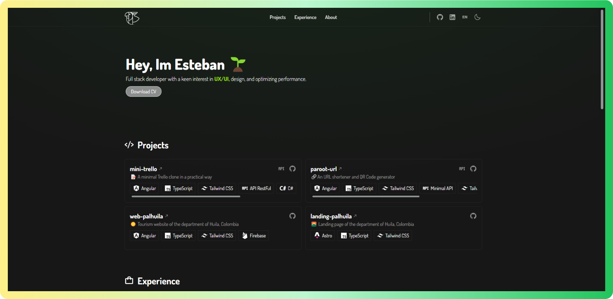

<div align="center">

<a href="https://estebanbss.dev" target="_blank">

</a>

</p>

<div align="center">
    <a href="https://estebanbss.dev" target="_blank">
        Website
    </a>
    <span>&nbsp;⁘&nbsp;</span>
    <a href="#-getting-started">
        Getting Started
    </a>
    <span>&nbsp;⁘&nbsp;</span>
    <a href="#-stack">
        Stack
    </a>
</div>

</p>


</div>


## ⚙ Stack

- [**Astro** + Typescript](https://astro.build/) - Build the web
  you want.
- [**Tailwind CSS**](https://tailwindcss.com/) - A utility-first CSS framework for rapidly building custom designs.
- [**Iconify/json**](https://www.npmjs.com/package/@iconify/json) - These icons can be used with many tools, plugins and components. They can also be exported as individual SVG files.

## 🚀 Getting Started

We recommend using the following extensions for Visual Studio Code:

- [**Astro for VSCode**](https://marketplace.visualstudio.com/items?itemName=astro-build.astro-vscode).
- [**Tailwind CSS IntelliSense**](https://marketplace.visualstudio.com/items?itemName=bradlc.vscode-tailwindcss).
- [**PostCSS Language Support**](https://marketplace.visualstudio.com/items?itemName=csstools.postcss).
- [**Prettier - Code formatter**](https://marketplace.visualstudio.com/items?itemName=esbenp.prettier-vscode).

1. Clone the repository:

```bash
git@github.com:estebanbss/website.git
```

2. Install dependencies:

```bash
npm install
# or
yarn install
# or
pnpm install
# or
ultra install
```

3. Run the development server:

```bash
npm run dev
# or
yarn dev
# or
pnpm dev
# or
ultra dev
```

Open up [http://localhost:4321](http://localhost:4321) to view the website 🚀.

📁 Folder structure:

```
[] .github - Funding file.
[] .vscode - Extensions, config & launch options for VSCode.
[] public - Static files.
[] src - Astro source code.
```

⚙ Commands:

| Command        | Action                                                  |
| :------------- | :------------------------------------------------------ |
| `dev`          | Starts local dev server at `localhost:4321`.            |
| `build`        | Build site to `./dist/`.                                |
| `preview`      | Preview your build locally, before deploying.           |
| `astro ...`    | Run Astro CLI commands like `astro add`, `astro check`. |
| `astro --help` | Get help using the Astro CLI.                           |
| `format`       | Format code with Prettier.                              |

## 🌱 Shortcuts

- estebanbss.dev[**/tw**](https://estebanbss.dev/cv) - Spanish Curriculum Vitae
- estebanbss.dev[**/tv**](https://estebanbss.dev/en/cv) - English Curriculum Vitae
- estebanbss.dev[**/ln**](https://estebanbss.dev/ln) - LinkedIn.
- estebanbss.dev[**/gh**](https://estebanbss.dev/gh) - Github profile.
- estebanbss.dev[**/git**](https://estebanbss.dev/git) - Github website repository.

## ☁ Deploy

I am using [**Firebase**](https://firebase.com/) for deployment:

- [**estebanbss.dev**](https://estebanbss.dev).
